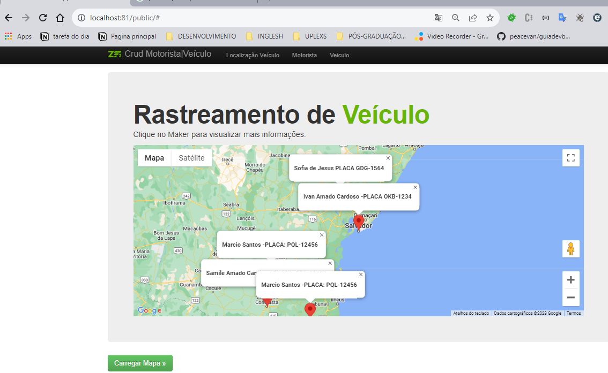
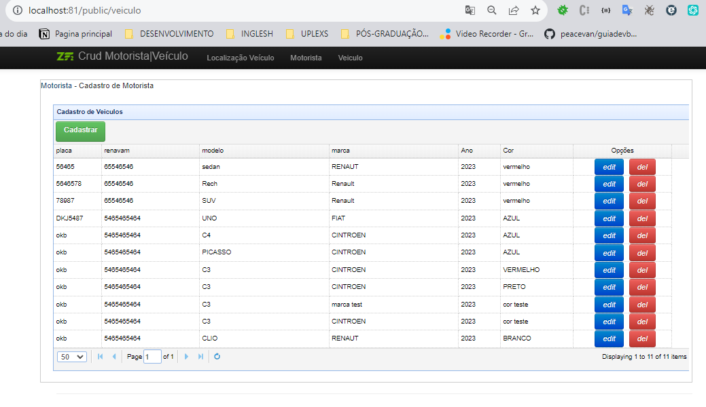
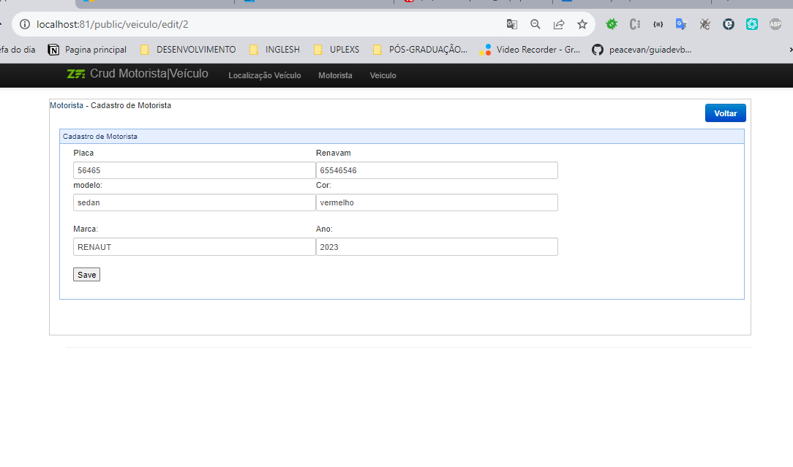
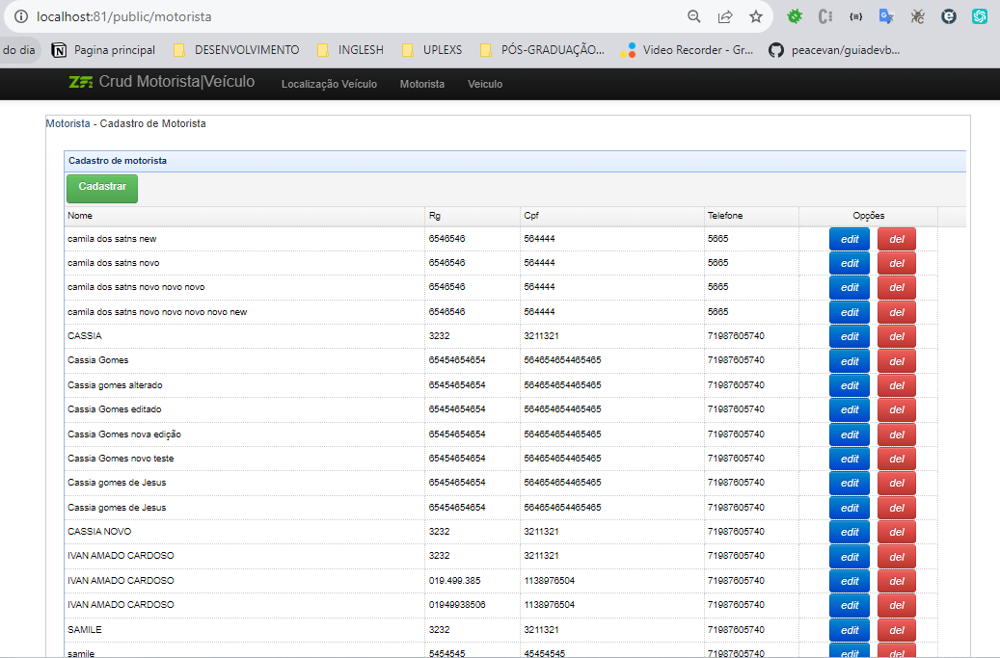
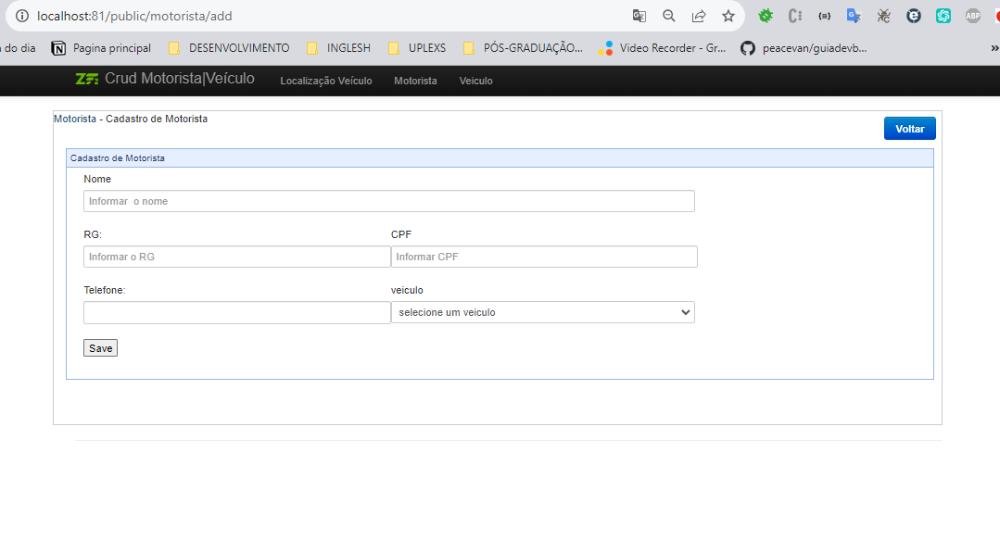

# Zend Framework 2 with Doctrine example application using ZendForm

# Nome do projeto

<!---Esses são exemplos. Veja https://shields.io para outras pessoas ou para personalizar este conjunto de escudos. Você pode querer incluir dependências, status do projeto e informações de licença aqui--->




>Tela de rastreamento de veiculo.

### Ajustes e melhorias

O projeto ainda está em desenvolvimento e as próximas atualizações serão voltadas nas seguintes tarefas:

- [x]  criação do banco de Dados e das tabelas  
- [x]  instalação e configuração do zend 2
- [x]  implementação da crud veiculo
- [x]  implementação da crud motorista
- [x]  criação da chave para o google Map
- [x]  implementação do google Map 
- [x]  implementação do windosform no map
- [x]  criação da camada service
- [x]  criação da camada repository
- [ ]  refatoração dos controller para  usar a  camada service
- [ ]  refatoração dos dos services para  usar a  camada repository
- [x]  Adicionar docker no projeto


## 💻 Pré-requisitos

Antes de começar, verifique se você atendeu aos seguintes requisitos:
<!---Estes são apenas requisitos de exemplo. Adicionar, duplicar ou remover conforme necessário--->
* Você instalou a versão mais recente de `<php7 / mysql / zend2>`
* Você tem uma máquina `<Windows / Linux />`. Indique qual sistema operacional é compatível / não compatível.
* Você leu `<guia / link / documentação_relacionada_ao_projeto>`.

## 🚀 Instalando <crud_motorista>

# Requisitos Mínimos:

 PHP 7.1 

Composer (gerenciador de dependências PHP)

Para instalar o crud_motorita, siga estas etapas:

Linux :
```
php -v

git clone https://github.com/peacevan/rastreador-veiculo-zend2.git
composer install
php -S 127.0.0.1:80
http://localhost:81/public/
```

Windows:
```
git clone https://github.com/peacevan/rastreador-veiculo-zend2.git
composer install
php -S 127.0.0.1:80 
http://localhost:81/public/
```

1. Instalar o docker-compose, PHP na versão 8.0 e Mysql

2. Docker

2.1 Baixar docker
``` 
  
```
3.2 imagem do php 7.1
``` 
   
```

4. Instalar docker-compose
``` 
   sudo apt install docker-compose
```

5. Execute o comando
``` 
   php composer.phar update
``` 
6. Execute o seguinte comando após atualizar o framework
``` 
    php composer.phar install -vvv
``` 
``` 
    docker-compose up
``` 
7. Acessa a seguinte url:
``` 
    locaohost:8000/public/
``` 


## ☕ Usando <nome_do_projeto>

Para usar <nome_do_projeto>, siga estas etapas:

```
<exemplo_de_uso>
```
# Banco de dados


# Tela  De Rastreamento de Veículo


>Tela de rastreamento de veiculo.


# telas de Veiculo




>Tela listar veiculo.



>Tela editar veiculo veículo.

# tela de motorista 




>Tela Listar motorista.



>Tela inserir motorista.


[⬆ Voltar ao topo](#crud_motorista)<br>


#### Versions Used

* doctrine/common                  2.3.0
* doctrine/dbal                    2.3.2
* doctrine/doctrine-module         0.7.1
* doctrine/doctrine-orm-module     0.7.0
* doctrine/orm                     2.3.2
* symfony/console                  v2.2.0
* zendframework/zendframework      2.1.3